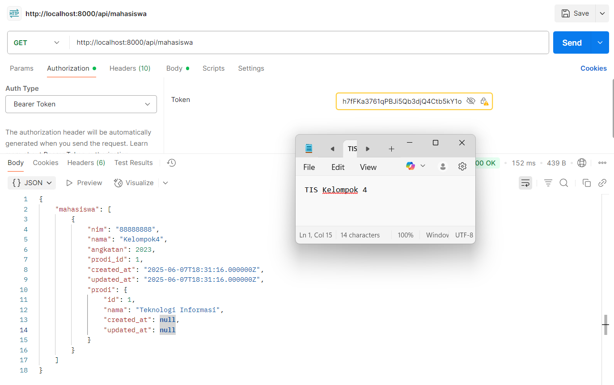

# UAP TIS: REST API Sistem Akademik (Tema Expert)

Berikut ini adalah proyek Ujian Akhir Praktikum untuk mata kuliah Teknologi Integrasi Sistem. Proyek ini mengimplementasikan sebuah REST API fungsional untuk sistem akademik sederhana menggunakan Lumen Framework, dengan fokus pada pengelolaan data Mahasiswa, Prodi, dan Mata Kuliah, serta relasi kompleks di antaranya.

## 👥 Anggota Kelompok

| No. | Nama | NIM |
| --- | --- | --- |
| 1. | Vonny Lorenza A. | [235150707111051] |
| 2. | Amelinda Devota | [235150701111043] |
| 3. | Abhista Tabina W | [235150701111044] |
| 4. | Adinda Febyola | [235150707111055] |
| 5. | Atha Azzahra K.N | [235150701111048] |
| 6. | Fiony Safa A | [235150701111053] |

## ⚙️ Teknologi yang Digunakan
* Lumen Framework 
* MySQL
* Tymon JWT-Auth untuk autentikasi berbasis token

## 🛠️ Kontribusi & Pembagian Tugas
Berikut adalah rincian kontribusi file kode oleh setiap anggota tim:

* **Vonny (API Integrator)**
    * `app/Http/Controllers/ApiController.php`: Mengimplementasikan seluruh logika bisnis untuk fitur-fitur setelah login.
    * `routes/web.php`: Mendaftarkan semua *endpoint* API dan mengelompokkannya sesuai dengan proteksi *middleware*.

* **Amel (Ketua Kelompok, Spesialis User & Autentikasi)**
    * `app/Models/Mahasiswa.php`: Membangun model User kompleks, lengkap dengan implementasi `JWTSubject`.
    * `app/Http/Controllers/AuthController.php`: Menangani seluruh logika untuk proses registrasi dan login user.
    * Pembuatan `README.md`

* **Nawa (Manajer Konfigurasi & Middleware)**
    * `bootstrap/app.php`: Mengonfigurasi dan mengaktifkan *service provider*, *facades*, dan *middleware*.
    * `config/auth.php`: Mengatur konfigurasi *guard* dan *provider* untuk autentikasi JWT.
    * `app/Http/Middleware/Authenticate.php`: Mengimplementasikan middleware untuk memproteksi *endpoint*.

* **Adin (Developer Modul Prodi)**
    * `app/Models/Prodi.php`: Membuat model untuk entitas Prodi beserta relasinya.
    * `database/migrations/..._create_prodi_table.php`: Mendefinisikan struktur tabel `prodi`.
    * `database/seeders/ProdiSeeder.php`: Menyediakan data awal untuk program studi.
    * `ERD`

* **Zara (Developer Modul Mata Kuliah)**
    * `app/Models/Matakuliah.php`: Membuat model untuk entitas Mata Kuliah beserta relasinya.
    * `database/migrations/..._create_matakuliah_table.php`: Mendefinisikan struktur tabel `matakuliah`.
    * `database/seeders/MatakuliahSeeder.php`: Menyediakan data awal untuk mata kuliah.
    * `ERD`

* **Fiony (Arsitek Relasi & Database)**
    * `database/migrations/..._create_mahasiswa_table.php`: Mendefinisikan struktur tabel `mahasiswa` dengan *foreign key*.
    * `database/migrations/..._create_mahasiswa_matakuliah_table.php`: Mendefinisikan struktur tabel pivot untuk relasi *many-to-many*.
    * `database/seeders/DatabaseSeeder.php`: Mengorkestrasi semua proses *seeding*.
    * `ERD`

## 📊 Dokumentasi & Demo Endpoint (Postman)

ERD 

DATABASE

Berikut adalah alur pengujian API dari awal hingga akhir.

---
### **BAGIAN 1: AUTENTIKASI (TANPA TOKEN)**
---

#### 1. Registrasi Mahasiswa Baru
* **Deskripsi**: Endpoint ini digunakan untuk membuat user (mahasiswa) baru.
* **Method**: `POST`
* **URL**: `/api/register`
* **Body**: `nim`, `nama`, `angkatan`, `password`, `prodi_id`

#### 2. Login & Mendapatkan Token JWT
* **Deskripsi**: Setelah berhasil mendaftar, user dapat login untuk mendapatkan token autentikasi. Token ini wajib digunakan untuk mengakses endpoint yang diproteksi.
* **Method**: `POST`
* **URL**: `/api/login`
* **Body**: `nim`, `password`

---
### **BAGIAN 2: FITUR UTAMA (MEMERLUKAN TOKEN)**
---

#### 3. Lihat Semua Mahasiswa
* **Deskripsi**: Menampilkan daftar seluruh mahasiswa yang terdaftar beserta data prodinya.
* **Method**: `GET`
* **URL**: `/api/mahasiswa`

Jika tidak menginputkan token atau token salah

#### 4. Lihat Semua Prodi
* **Deskripsi**: Menampilkan daftar seluruh program studi yang tersedia dari database.
* **Method**: `GET`
* **URL**: `/api/prodi`

Jika tidak menginputkan token atau token salah

#### 5. Filter Mahasiswa Berdasarkan Prodi
* **Deskripsi**: Menampilkan daftar mahasiswa yang hanya berasal dari prodi tertentu.
* **Method**: `GET`
* **URL**: `/api/mahasiswa/prodi/{id}` (Contoh: `/api/mahasiswa/prodi/1`)

Jika tidak menginputkan token atau token salah

#### 6. Lihat Semua Daftar Mata Kuliah
* **Deskripsi**: Menampilkan seluruh mata kuliah yang tersedia di universitas (dari seeder).
* **Method**: `GET`
* **URL**: `/api/matkul`

Jika tidak menginputkan token atau token salah

#### 7. Menambahkan Mata Kuliah ke Mahasiswa (KRS)
* **Deskripsi**: Mahasiswa yang login dapat "mengambil" atau mendaftarkan mata kuliah ke dalam rencanan studinya.
* **Method**: `POST`
* **URL**: `/api/matkul/tambah`
* **Body**: `mkId` (ID dari mata kuliah yang ingin diambil, contohnya (1))

Jika mencoba menambahkan mata kuliah yang telah diambil

Jika tidak menginputkan token atau token salah

#### 8. Lihat Daftar Mata Kuliah Milik Mahasiswa
* **Deskripsi**: Menampilkan detail mata kuliah spesifik yang telah diambil oleh mahasiswa yang sedang login.
* **Method**: `GET`
* **URL**: `/api/matkul/{id}` (Contoh: `/api/matkul/1`)

Apabila mencari id matkul yang tidak ditambah sebelumnya

Jika tidak menginputkan token atau token salah

## 🎥 Video Presentasi
Untuk penjelasan yang lebih detail dan demonstrasi langsung, berikut saya lampirkan video presentasi kami melalui tautan berikut:

**[Video Presentasi](https://drive.google.com/drive/folders/1AFExNi6jHWsZeu-HGSGa3gtHtMa7xb-N?usp=sharing)**